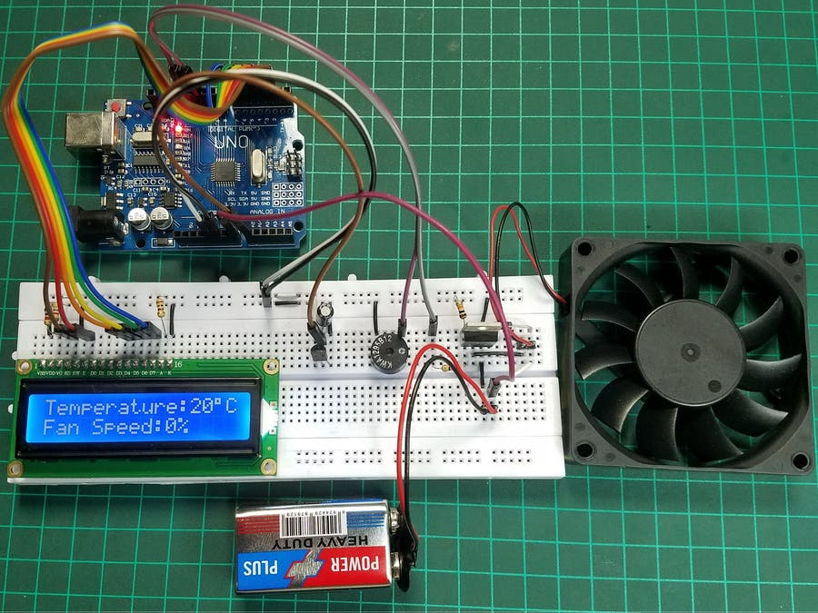

<!-- PROJECT LOGO -->
<br />
<p align="center">
  <a href="https://github.com/ti-dragonns/Arduino-Server-Management-System">
    
  </a>

  <h3 align="center">Arduino-Server-Management-System</h3>

  <p align="center">
    Arduino Server Management System, for controling multiple fans speed, view CPU, RAM and IP on a 1602LCD
    <br />
    <br />
  </p>
</p>

<!-- TABLE OF CONTENTS -->
<details open="open">
  <summary>Table of Contents</summary>
  <ol>
    <li>
      <a href="#about-the-project">About The Project</a>
      <ul>
        <li><a href="#built-with">Built With</a></li>
      </ul>
    </li>
    <li>
      <a href="#getting-started">Getting Started</a>
      <ul>
        <li><a href="#prerequisites">Prerequisites</a></li>
        <li><a href="#installation">Installation</a></li>
      </ul>
    </li>
    <><a href="#contact">Contact</a></>
  </ol>
</details>

<!-- ABOUT THE PROJECT -->

## About The Project

<a href="https://github.com/ti-dragonns/Arduino-Server-Management-System">
    
  </a>

I decided to build my own 1U Server from a old switch case and DIY to make it work, but then i wanted to give it a professional look so i added a 16x02 LCD on the front panel with a encoder knob to navigate trough the menus of a Arduino Mega.

Here's why:

- Easy control of each fan speed
- Change between auto or manual mode of fan control
- Quickly find the IP of that Server trough the screen

### Built With

It's a easy and simple project using only a few lines of code.

- [Arduino](https://www.arduino.cc/)

<!-- GETTING STARTED -->

## Getting Started

This is an example of how you may give instructions on setting up your project locally.
To get a local copy up and running follow these simple example steps.

### Prerequisites

This is an example of how to list things you need to use the software and how to install them.

- npm
  ```sh
  npm install npm@latest -g
  ```

### Installation

1. Get a free API Key at [https://example.com](https://example.com)
2. Clone the repo
   ```sh
   git clone https://github.com/your_username_/Project-Name.git
   ```
3. Install NPM packages
   ```sh
   npm install
   ```
4. Enter your API in `config.js`
   ```JS
   const API_KEY = 'ENTER YOUR API';
   ```


<!-- CONTACT -->

## Contact

Your Name - [@your_twitter](https://twitter.com/your_username) - email@example.com

Project Link: [https://github.com/your_username/repo_name](https://github.com/your_username/repo_name)
